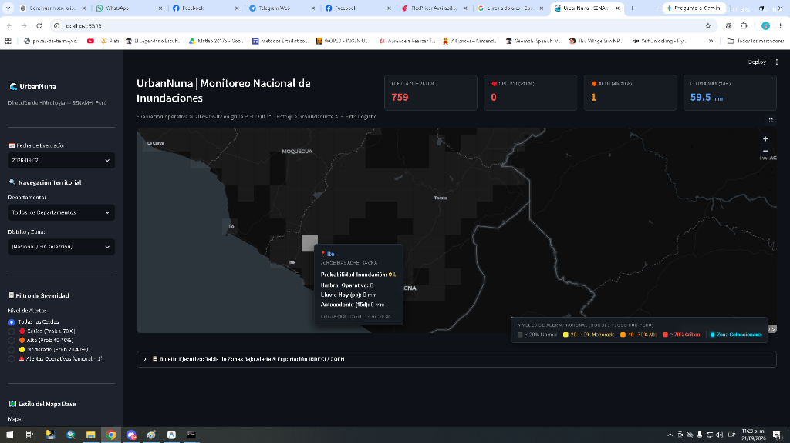
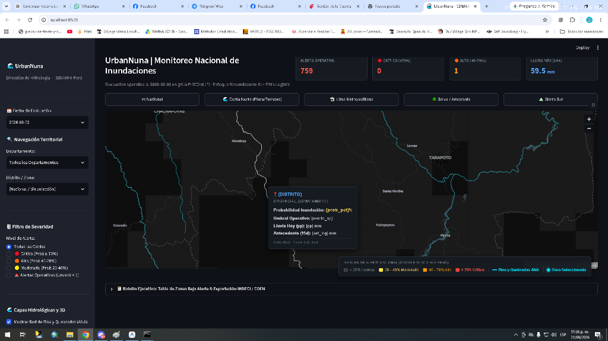

# UrbanNuna | Sistema de Monitoreo Nacional de Inundaciones Urbanas (SENAMHI)

[](http://localhost:8505)
[](https://www.senamhi.gob.pe)
[](#)

Visor web interactivo de monitoreo e inferencia probabilística de inundaciones urbanas para el territorio peruano, desarrollado en **Python / Streamlit / PyDeck WebGL** y articulado sobre la grilla **PISCO ($0.1^\circ$, ~11 km)**.

---

## 📸 Capturas de la Plataforma

### Vista Nacional Ejecutiva con Ficha Técnica


### Red Fluvial ANA y Navegación Macro-Regional


---

## 🚀 Capacidades Principales (Google Flood Hub Perú)

1. **Balizas de Alerta (Flood Beacons):** Núcleos con halo luminoso difuso (rojo, naranja y amarillo) para detección inmediata de celdas críticas a nivel país.
2. **Red de Ríos y Quebradas ANA:** Capa hidrográfica optimizada (1.7 MB) con trazo sutil (0.6 px, 30% opacidad) que no interfiere con el mapa de riesgo.
3. **Navegación Territorial y Fly-To Zoom:** Filtros en cascada (Departamento $\rightarrow$ Distrito) con anillo de enfoque neón cian.
4. **Píldoras Macro-Regionales:** Salto rápido en un clic a *Nacional*, *Costa Norte (Piura/Tumbes)*, *Selva / Amazonía* y *Sierra Sur*.
5. **Diagnóstico Hídrico:** Gráfica interactiva de barras (Altair) que desglosa la **Lluvia de Hoy ($pp$ mm)** frente al **Antecedente Saturante ($ant$ 15 días)**.
6. **Modo 3D:** Extrusión volumétrica de celdas según probabilidad de inundación con perspectiva angular a 45°.
7. **Boletín INDECI / COEN:** Tabla interactiva y exportación de alertas a CSV.

---

## 💻 Puesta en Marcha Local

### Opción 1: Lanzador Directo (1 Doble Clic)
Ejecutar el archivo:
```bat
INICIAR_VISOR.bat
```

### Opción 2: Terminal / PowerShell
```powershell
# Activar entorno virtual e iniciar en puerto 8505
.venv\Scripts\python.exe run_server.py
```
El visor se abrirá en Google Chrome en: **`http://localhost:8505`**

---

## 🏛️ Créditos Institucionales
- **Dirección de Hidrología — SENAMHI Perú (2026)**
- **Metodología:** Firth Logistic Regression + Groundsource AI + PISCO Operativo.
